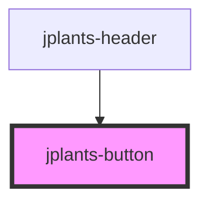

# jplants-button

<!-- Auto Generated Below -->

## Properties

| Property          | Attribute           | Description | Type     | Default     |
| ----------------- | ------------------- | ----------- | -------- | ----------- |
| `buttonColor`     | `button-color`      |             | `string` | `undefined` |
| `buttonHref`      | `button-href`       |             | `string` | `undefined` |
| `buttonIconClass` | `button-icon-class` |             | `string` | `undefined` |
| `buttonName`      | `button-name`       |             | `string` | `undefined` |

## Dependencies

### Used by

 - [jplants-header](../jplants-header)

### Graph

----------------------------------------------

*Built with [StencilJS](https://stenciljs.com/)*
