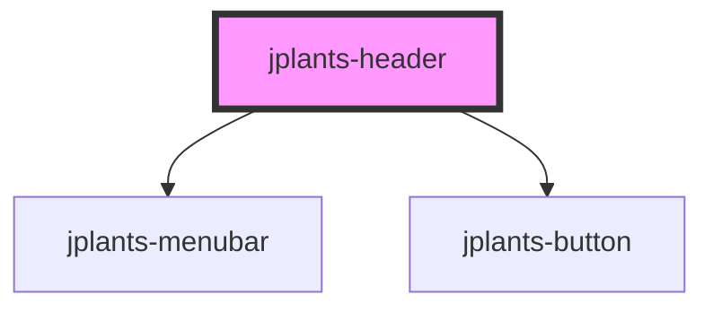

# jplants-header

<!-- Auto Generated Below -->

## Properties

| Property       | Attribute        | Description | Type     | Default              |
| -------------- | ---------------- | ----------- | -------- | -------------------- |
| `logo`         | `logo`           |             | `string` | `"jplants-logo.png"` |
| `logoHref`     | `logo-href`      |             | `string` | `"#"`                |
| `navLinksJson` | `nav-links-json` |             | `string` | `undefined`          |

## Dependencies

### Depends on

- [jplants-menubar](../jplants-menubar)
- [jplants-button](../jplants-button)

### Graph

----------------------------------------------

*Built with [StencilJS](https://stenciljs.com/)*
