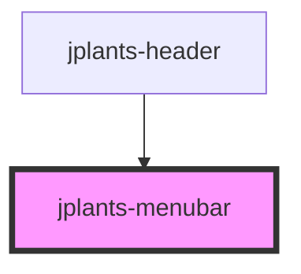

# jplants-menubar

<!-- Auto Generated Below -->

## Properties

| Property        | Attribute         | Description | Type     | Default     |
| --------------- | ----------------- | ----------- | -------- | ----------- |
| `navItemsLinks` | `nav-items-links` |             | `string` | `undefined` |

## Events

| Event    | Description | Type               |
| -------- | ----------- | ------------------ |
| `onShow` |             | `CustomEvent<any>` |

## Dependencies

### Used by

 - [jplants-header](../jplants-header)

### Graph

----------------------------------------------

*Built with [StencilJS](https://stenciljs.com/)*
